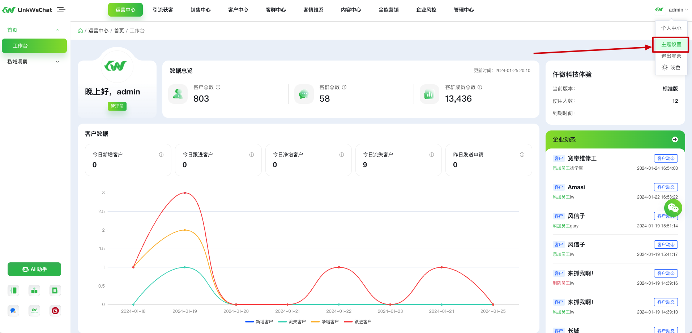
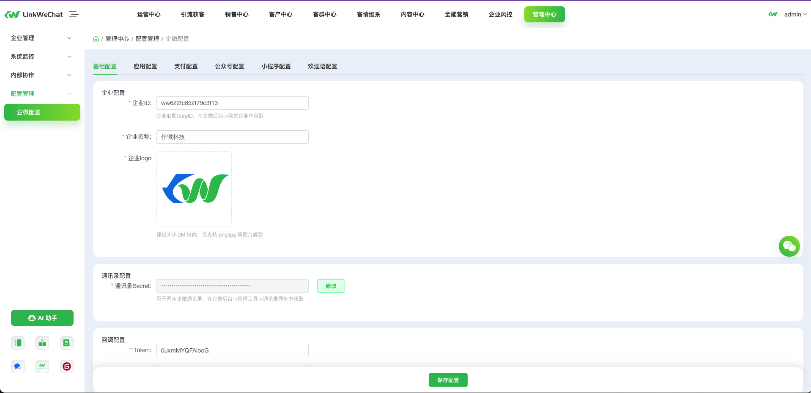

# 前端技术手册

# 仓库简介

`vue3-lw-pc` 为 pc 后台管理端项目，技术栈采用 [[vue3](https://cn.vuejs.org/) [vite](https://cn.vitejs.dev/) [pinia](https://pinia.vuejs.org/zh/) [element-plus](https://element-plus.gitee.io/zh-CN/)]

`vue3-lw-mobile` 为移动端 vue3 项目，技术栈采用 [[vue3](https://cn.vuejs.org/) [vite](https://cn.vitejs.dev/) [pinia](https://pinia.vuejs.org/zh/) [vant4](https://vant-contrib.gitee.io/vant/#/zh-CN)]，包含客服升级，AI 助手等 2024.01.01 之后及未来的移动端新功能，

`linkwe-mobile` 为移动端 vue2 项目，技术栈采用 [[vue2](https://cn.vuejs.org/) [Vue CLI](https://cli.vuejs.org/zh/) [vuex3](https://v3.vuex.vuejs.org/zh/) [vant2](https://vant-contrib.gitee.io/vant/v2/#/zh-CN/)]，包含移动工作台、任务宝、群裂变等 2024.01.01 之前的功能，会维护和迭代已有功能，但不会加入新功能

本地所需 [Node](https://nodejs.org/dist/) 版本推荐为: v16.x 或 v18.x+，不支持 v16 以下版本，不推荐 v17

# 在线体验

官方演示地址：https://demo.linkwechat.net/ （演示环境已屏蔽管理权限和相关操作）

目前支持两种方式体验：

- 快速体验：点击账密登录并勾选演示账号登录即可在线体验后台系统，但不支持体验移动端相关功能；
- 完整体验：在首页扫码二维码申请加入测试企业，申请通过后即可扫码登录，体验系统的完整功能；

# 项目结构

```
├── vue3-lw-pc			// 后台管理端项目
    ├── public                     # 静态资源
    │   │── static                 # 用于绝对路径的非打包资源，公用基础css等
    │   │── favicon.png            # favicon图标
    ├── src                        # 源代码
    │   ├── api                    # 所有后端接口请求
    │   ├── assets                 # 主题 字体 svg icons 等静态资源
    │   ├── components             # 全局公用组件
    │   ├── directive              # 全局指令
    │   ├── layout                 # 全局基础布局结构组件
    │   ├── router                 # 路由 权限管理等
    │   ├── stores                 # 全局 pinia store管理
    │   ├── styles                 # 全局样式
    │   ├── utils                  # 全局公用方法
    │   ├── views                  # 业务功能所有页面
    │   ├── App.vue                # 入口页面
    │   ├── main.js                # 入口文件 加载组件 初始化等
    ├── babel.config.js            # babel-loader 配置
    ├── config.js                  # 全局配置文件
    ├── env.js                     # 环境变量配置
    ├── index.html                 # html模板
    ├── jsconfig.json              # jsconfig 配置 快捷路径等
    ├── package.json               # package.json
    ├── vite.config.js             # vite 配置
├── vue3-lw-mobile		// 移动端vue3项目，包含客服升级，AI助手等2024.01.01之后的移动端新功能
├── linkwe-mobile		  // 移动端vue2项目，包含移动工作台、任务宝、群裂变等2024.01.01之前的功能
├── linkwe-uniapp		  // uniapp短链小程序项目
├── LICENSE		        // 仓库协议
├── README.md		      // readme
├── RELEASES.md		    // 更新日志
```

# 运行部署

```sh
# 克隆项目
git clone https://gitee.com/LinkWeChat/link-we-chat-front.git

# 进入项目目录
cd link-we-chat-front/vue3-lw-pc

# 安装依赖（下面几种方式在不同的机器上，成功率不同，自行尝试）

# 方式一： npm 指定淘宝镜像
npm i --registry=https://registry.npmmirror.com

# 方式二： 使用 cnpm 安装
npm install -g cnpm --registry=https://registry.npmmirror.com
cnpm i

# 方式三： npm i 原始安装 国内推荐上述两种方式 DDDD(懂的都懂)
npm i

# 启动开发服务 npm run dev
# 启动测试开发服务 npm run test (本地开发，后端接口为测试环境接口)
# 前端访问地址 http://localhost:1024

# 构建生产环境 npm run build
# 构建测试环境 npm run build:test
# 构建开发环境 npm run build:dev

# deploy 自动化部署
# 部署生产 deploy prod
# 部署开发 deploy dev
```

[自动化部署配置指导](../vue3-lw-pc/deploy/_deploy.config.js)

# 基础配置

在 [vue3-lw-pc/env.js](../vue3-lw-pc/env.js) 中配置开发、生产等各个环境的：接口域名、路由基础路径，页面基础路径等

```js
/**
 * 环境变量
 * 以下划线 '_' 开头的字段表示只在build命令打包时有效，勿在项目中使用
 */
const envs = {
  development: {
    DOMAIN: 'https://dev.linkwechat.net', // 接口域名（站点域名请使用：window.location.origin）
    BASE_URL: '/', // 页面路由基础路径 /*/*/，eg：/lw/，不支持 ’./‘形式的路径
    BASE_API: 'https://dev.linkwechat.net/linkwechat-api', // 接口基础路径
    _ISGZIP: true, // 是否开启gzip压缩
    _ISCDN: true, // 是否开启cdn加速
  },
  test: {
    DOMAIN: 'https://demo.linkwechat.net',
    BASE_URL: '/', // 路由基础路径
    BASE_API: 'https://demo.linkwechat.net/linkwechat-api',
    _ISGZIP: true,
    _ISCDN: true,
  },
  production: {
    DOMAIN: 'https://demo.linkwechat.net',
    BASE_URL: '/', // 路由基础路径
    BASE_API: 'https://demo.linkwechat.net/linkwechat-api',
    _ISGZIP: true,
    _ISCDN: false,
  },
}
```

- 关于 cdn 加速 的配置说明：

  在 [vue3-lw-pc/vite.config.js](../vue3-lw-pc/vite.config.js) 里的 `vitePluginCdnImport` 插件中配置各个需要使用 cdn 的文件地址，默认使用的是开源免费的 bootcdn 服务，大家酌情使用

# 系统配置

在 [vue3-lw-pc/config.js](../vue3-lw-pc/config.js) 中配置 系统名称、版权信息、logo 地址等信息，具体参见各配置项的注释说明

```js
// 下为示例快照，具体以 config.js 中为准
// 系统内常量默认配置，只能从外部配置，内部不可修改
const common = {
  SYSTEM_NAME: 'LinkWeChat', // 系统简称
  SYSTEM_NAME_MOBILE: 'LinkWeChat', // 移动端应用简称
  SYSTEM_NAME_ALL: 'LinkWeChat -- 全链路私域数字化营销增长解决方案', // 系统全称
  COMPANY_NAME: 'LinkWeChat', // 公司简称
  COMPANY_NAME_ALL: 'LinkWeChat', // 公司全称
  COPYRIGHT:
    'Copyright © 2018-2023 LinkWeChat All Rights Reserved. 备案号：<a href="https://beian.miit.gov.cn/">皖ICP备022014134号-1</a>', // 版权信息
  LOGO_DARK: env.BASE_URL + 'static/LOGO_DARK.png', // 深色logo
  LOGO_LIGHT: env.BASE_URL + 'static/LOGO_LIGHT.png', // 淡色logo
  LOGO_TEXT_DARK: env.BASE_URL + 'static/LOGO_TEXT_DARK.png', // 深色logo+文字
  LOGO_TEXT_LIGHT: env.BASE_URL + 'static/LOGO_TEXT_LIGHT.png', // 淡色logo+文字
  QRCODE_CONTACT_US: env.BASE_URL + 'static/QRCODE_CONTACT_US.png', // 联系我们二维码
  QRCODE_CUSTOMER_SERVICE: env.BASE_URL + 'static/QRCODE_CUSTOMER_SERVICE.png', // 客服二维码
  POST_QRCODE: env.BASE_URL + 'static/POST_QRCODE.png', // 海报占位二维码
  AGREEMENT: env.BASE_URL + 'static/AGREEMENT.pdf', // 用户协议pdf
  PRIVACY: env.BASE_URL + 'static/PRIVACY.pdf', // 隐私协议pdf
  COOKIEEXPIRES: 0.5, // token在Cookie中存储的天数，默认0.5天
  WORK_WEIXIN_CONFIG_ROUTE_NAME: Symbol(), // 企业微信设置页面路由名称, 用于router 通过name判断与跳转，避免使用path不易于扩展
  CUSTOMER_DETAIL_ROUTE_NAME: Symbol(), // 客户详情页面路由name，同上
  GROUP_DETAIL_ROUTE_NAME: Symbol(), // 客群详情
  DEFAULT_H5_PIC: env.BASE_URL + 'static/PIC.png',
  DEFAULT_H5_ART: env.BASE_URL + 'static/ARTICAL.png', // 文章默认封面
  DEFAULT_H5_TP: env.BASE_URL + 'static/TEXT_PIC.png', // 图文默认封面
  DEFAULT_H5_PDF: env.BASE_URL + 'static/PDF.png', // pdf默认封面
  DEFAULT_H5_WORDE: env.BASE_URL + 'static/WORD.png',
  DEFAULT_H5_PPT: env.BASE_URL + 'static/PPT.png',
  PRIVIEW_PATH: window.location.origin + '/mobile/#/metrialDetail?materiaId=',
  BAIDU_MAP_KEY: '6fZIymhpgfnAHUT1baHeEF922lPIThOG', // 百度地图key
  IS_PUBLISH_DIALOG: false, // 是否显示发布弹窗
  IS_LINKWECHAT: true, // 是否显示linkwechat开源相关业务组件
  PRIVIEW_URL: env.DOMAIN + '/fileView/onlinePreview?url=', // kkfileview，素材预览服务地址
}
```

- 关于部分配置常量的说明：

  - 关于 `LOGO_DARK, POST_QRCODE, DEFAULT_H5_ART` 等静态资源文件的配置，此类相关地址默认对应于当前项目 `vue3-lw-pc/public/static` 文件夹下的对应文件，修改方式可通过替换相应的资源文件或使用一个外部资源的 url 地址
  - 关于 `BAIDU_MAP_KEY` 百度地图 key 需要自行[前往官网申请](https://lbsyun.baidu.com/apiconsole/key#/home)，默认配置的由于配额有限不支持使用

# 线上配置

项目打包上线后，在某些情况下，我们可能需要临时或应急修改某个常量的配置信息，此时就涉及到修改线上的配置信息。

在打包后的文件夹里我们可以看到 `static` 文件夹同样也有个 `config.js`文件，可以在这里修改覆盖相关配置信息, 修改完之后直接替换线上的`config.js`文件即可

```js
// 用于线上配置，会覆盖系统相关配置
// window.lwConfig = {
//   SYSTEM_NAME: 'LinkWeChat SaaS',
//   SYSTEM_NAME_ALL: 'LinkWeChat 企业微信SCRM SaaS',
//   COMPANY_NAME: '仟微科技',
//   COMPANY_NAME_ALL: '仟微科技网络有限公司',
//   COPYRIGHT: 'Copyright © 2018-2022 LinkWeChat All Rights Reserved.',
//   // LOGO_DARK: '/static/LOGO_DARK.png',
//   // LOGO_LIGHT: '/static/LOGO_LIGHT.png',
//   // LOGO_TEXT_DARK: '/static/LOGO_TEXT_DARK.png',
//   // LOGO_TEXT_LIGHT: '/static/LOGO_TEXT_LIGHT.png',
//   // QRCODE_CONTACT_US: '/static/QRCODE_CONTACT_US.png',
//   // QRCODE_CUSTOMER_SERVICE: '/static/QRCODE_CUSTOMER_SERVICE.png',
//   // IS_PUBLISH_DIALOG: false, // 是否显示发布弹窗
//   DOMAIN: 'http://saas.linkwechat.cn',
//   // BASE_URL: '/', // 路由基础路径
//   BASE_API: 'http://saas.linkwechat.cn/prod-api',
//   SYSTEM_API: '/saas-prod-api',
// }
```

# Nginx 前端服务相关配置示例

查看[nginx.conf 示例](./nginx.conf)

```sh
server {

  # ****

  # pc 后台管理端
  location / {
    root /usr/local/nginx/html/prod/pc;
    index index.html index.htm;
    try_files $uri $uri/ /index.html;
    proxy_read_timeout 150;

    # 处理跨域
    add_header Access-Control-Allow-Origin '*' always;
    # add_header Access-Control-Allow-Headers '*';
    add_header Access-Control-Allow-Methods '*';
    # add_header Access-Control-Allow-Credentials 'true';
    if ($request_method = 'OPTIONS') {
      return 204;
    }
  }

  # vue2移动端
  location /mobile {
    alias /usr/local/nginx/html/prod/h5;
    try_files $uri $uri/ /mobile/index.html;
    index index.html;
  }

  # vue3移动端
  location /m {
    alias /usr/local/nginx/html/prod/m;
    try_files $uri $uri/ /m/index.html;
    index index.html;
  }

}

#短链
server {
    listen 80;
    server_name sl.linkwechat.net;

    location ^~/st/ {
        proxy_set_header Host $http_host;
        proxy_set_header X-Real-IP $remote_addr;
        proxy_set_header REMOTE-HOST $remote_addr;
        proxy_set_header X-Forwarded-For $proxy_add_x_forwarded_for;
        #			proxy_pass http://localhost:6180/open/t/;
        proxy_pass http://localhost:6180/open/;

    }

}
```

# 主题修改

代码层面：系统主题色使用 css 变量控制颜色的 hsl 模式，可在 [var.css](../vue3-lw-pc/public/static/css/var.css) 中修改。

无极换肤：


# 系统参数配置页面

项目运行登录后，可前往菜单 【管理中心-配置管理-企微配置】 页面中配置系统功能运行所需的相关信息



# 路由菜单管理

## 权限菜单

对于功能权限菜单可在 【管理中心-企业管理-菜单管理】页面中新增或修改

## 通用菜单

对于公用且无角色权限要求的功能菜单可在前端路由文件 `src/router/routes.js` 中定义
