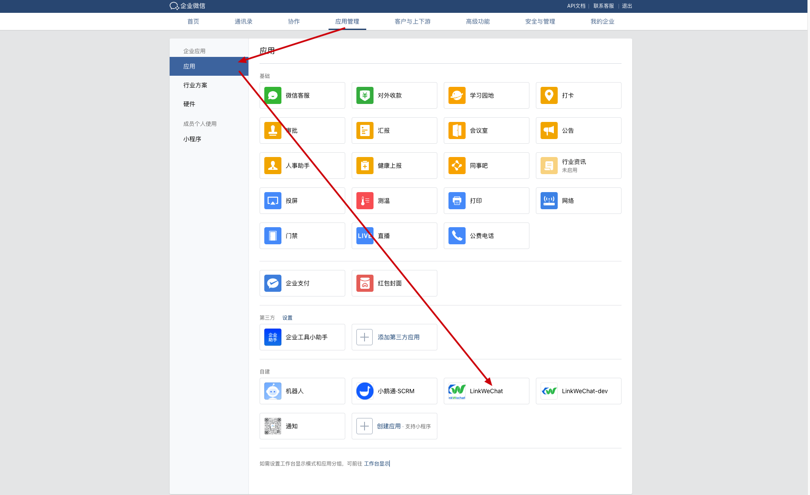
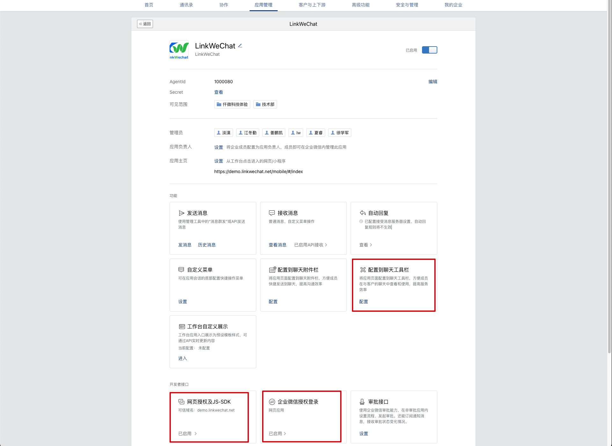
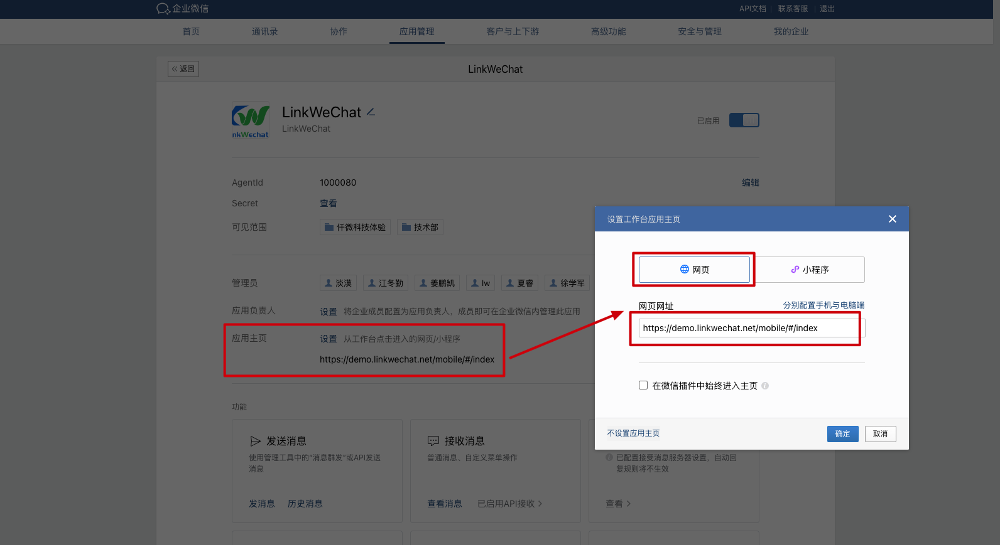
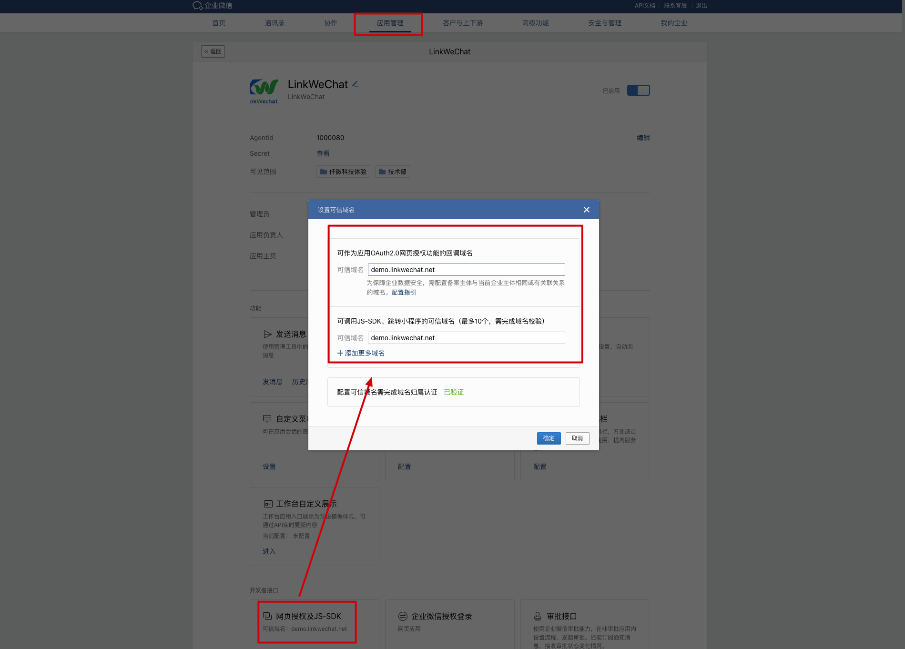
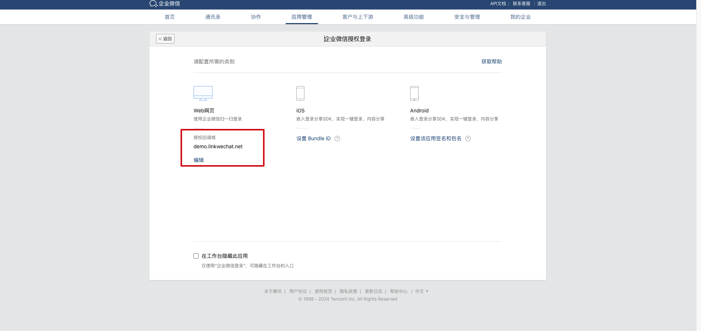
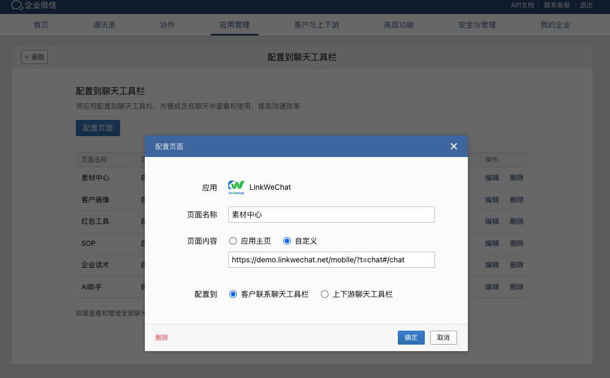
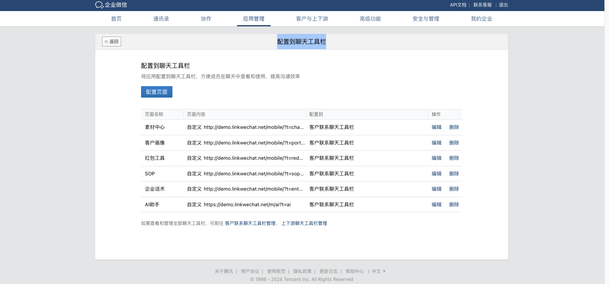
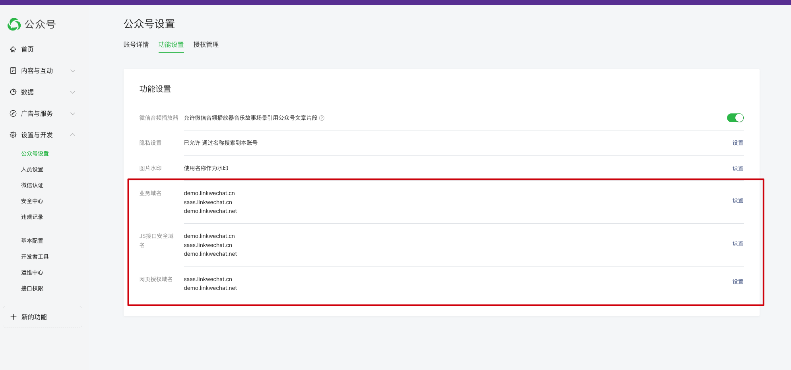

# 移动端手册

linkwe-mobile、vue3-lw-mobile 项目与 vue3-lw-pc 架构基本雷同，代码层面配置对应参考上述 pc 项目配置，不作赘述

linkwe-uniapp 只有一个活码识别页面，属于基础的 uniapp 项目，可参考其[官方文档](https://uniapp.dcloud.net.cn/tutorial/)

## 企微配置

### 在企业微信后台配置自建应用：应用主页、网页授权、登录授权，侧边栏等




### 配置应用主页



### 配置网页授权可信域名，注意需配置备案主体与当前企业主体相同或有关联关系的域名



### 配置企业微信授权登录域名



### 配置到聊天工具栏




### 聊天工具栏页面链接

示例如下，把对应的 `demo.linkwechat.net` 改为自己实际使用的域名即可，如果对页面链接做了修改或未按照官方推荐配置(如自行定义 mobile 的路径或域名等)，则同理改为修改后的页面路径

- 素材中心: https://demo.linkwechat.net/mobile/?t=chat#/chat
- 客户画像: https://demo.linkwechat.net/mobile/?t=portrait#/portrait
- 红包工具: https://demo.linkwechat.net/mobile/?t=redPacket#/redPacket
- SOP: https://demo.linkwechat.net/mobile/?t=sop#/sop
- 企业话术: https://demo.linkwechat.net/mobile/?t=enterpriseChat#/enterpriseChat
- AI 助手: https://demo.linkwechat.net/m/ai?t=ai

## 微信公众号配置域名



## 微信小程序配置域名


## 移动端页面开发说明

```js
/**
 * 路由字段说明
 * meta:{
 *   title: 页面标题
 *   noAuth: 设置页面是否关闭授权登录鉴权，用于本地开发静态页面调试和某些不要登录的页面
 *   authType: 登录类型： 企微登录（默认），wechat(微信登录)
 *   wxSDKConfigType:  wx JS SDK config类型; 取值: 无值默认(企微端), wechat(微信端), no(不调用sdk config配置)
 * }
 */
{
  path: '/',
  name: 'Home',
  component: Home,
  meta: {
    title: '',
    noAuth: true,
  },
}
```

- 路由里的 noAuth: 设置页面是否关闭授权登录鉴权，用于本地开发静态页面调试和某些不要登录的页面
- 对需要企微环境的页面功能，需要打包到企微运行进行线上调试，或者把在线上拿到企微的实际数据，在本地模拟调试，无法模拟的就只能线上调试了，企微目前没有提供类似微信开发者工具的模拟工具
